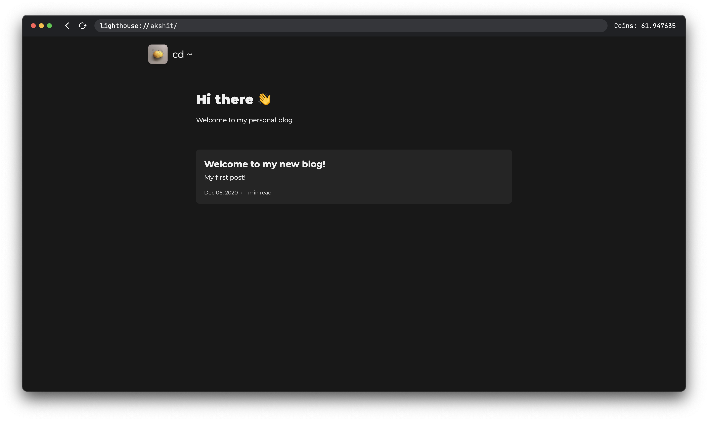

<h1 align="center">Lighthouse</h1>
<p align="center">The peer for Lighthouse p2p</p>

---

## Screenshots





## Building

### Requirements

- Golang installed on your system

### How to build

- Clone this repo using `git clone --recursive https://github.com/lighthouse-p2p/lighthouse`. Take a note of the `--recursive` flag. Lighthouse has a copy of [Lighthouse Desktop](https://github.com/lighthouse-p2p/desktop) as one of its submodules. `--recursive` will clone that too.
- Build the desktop app (optional, only supported on MacOS and Windows)
  - `cd` into `desktop`
  - Follow the build steps [here](https://github.com/lighthouse-p2p/desktop) :)
- Make a directory named `build`
- - For POSIX systems, run `go build -o build/lighthouse cmd/lighthouse/main.go`
  - For Windows systems, in a PowerShell window, `go build -o .\build\lighthouse.exe .\cmd\lighthouse\main.go`
- If you built the desktop application, copy the binary to `build` and rename to
  - `lighthouse-desktop.app` for MacOS
  - `lighthouse-desktop.exe` for Windows

## Running

You can simply run the peer by running

- `./cmd/lighthouse` for POSIX systems, or
- `.\cmd\lighthouse.exe` for Windows systems

On first run, it will ask to register and create a metadata file. You can follow the on-screen steps to do the same.

**Note:** While entering the host, do not enter "http://" or "https://" or trailing "/". `http://localhost:3000/` is an invalid host, while `localhost:3000` is valid.

After the registration, it will create a `metadata.json` file. **DO NOT** commit it or upload it to a public file hosting service. It has your private key.

As a rule on lighthouse's network, everyone needs to serve something (empty folder works too 🙂, but you will run out of coins if you don't serve anything). Create a new `data` directory to keep anything you want to serve. The peer won't start without a `data` directory.

If you were on a supported platform (MacOS, Windows) and skipped the build for the desktop application, please pass the `--no-gui` flag while running the binary. Without it, the application won't start.

With everything in place, your current directory will look like

```
.
├───build
│   ├───lighthouse (.exe for windows)
│   └───lighthouse-desktop (.app/.exe depending on the platform, optional)
│───data
│   └───...
│───...
└───metadata.json
```

Now, just run the binary same as in the first step. It will authenticate, start the proxy servers and optionally launch the desktop application. At this point you could connect to different peers and start experiencing some p2p magic.

**Note:** For security reasons, the [lighthouse hub](https://github.com/lighthouse-p2p/hub) needs to run behind a TLS-secured proxy with websocket support. When the peer connects to the hub on a non-local (`localhost:*`, `192.168.*`, `10.*`) address, it automatically switches to HTTPS. The connections will intentionally fail if your server doesn't support TLS, or doesn't have a valid certificate signed by a trusted CA.

### Accessing the network without the desktop application

Lighthouse runs a proxy on the address `127.0.0.1:42000`. It is bound to the loopback interface, so don't worry, no-one else would be able to use your coins :)

To check the amount of coins in your wallet, you can open `http://localhost:42000/coins` in a normal web browser. It will give you back the number of coins remaining with you.

To connect to other peers, open `http://localhost:42000/proxy/{peer-name}` where `peer-name` should be replaced with the name of the peer you want to connect to, without the `{}`. It will make a WebRTC session, and then redirect you to the TCP proxy for that peer.

Bonus: You can view the internal system stats at `http://localhost:42000/stats`. It shows the number of active `goroutines`.

---

## How it works

Click [here](https://github.com/lighthouse-p2p/docs) to see the documentation about the protocol and the algorithm used.

---

## License

Lighthouse is licensed under the `GPL-3.0-or-later` license. You can obtain a copy [here](https://www.gnu.org/licenses/gpl-3.0.html).
